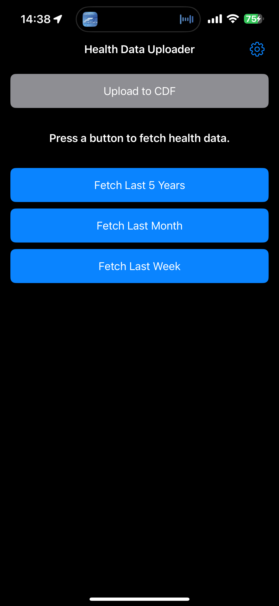
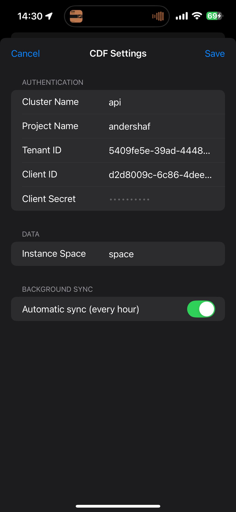
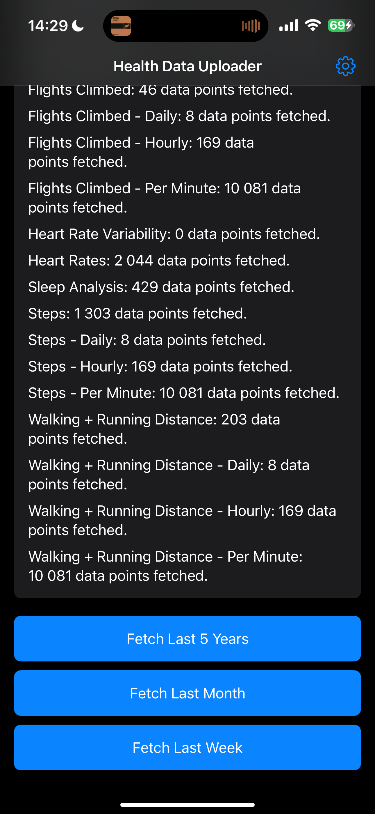

# Apple Health to CDF extractor

This extractor fetches data from Apple Health and sends the data into CDF.

The data fetched includes:

- Activity data (steps, flights climbed, energy)
- Heart rate
- Heart rate variability

Please help adding more relevant data (such as sleep)!

## Usage

You need to install this app on your phone using XCode on a mac. To do this, you need to be a [registered apple developer](https://developer.apple.com/programs/enroll/) which costs about $99 / year. However, if you contact Anders Hafreager, he can help installing the app on your phone.

You will need a service account with client credentials (client id and client secret) to your CDF project and configure this in the app, see

The service account needs to have access to create spaces and data modeling instances into that space. It will create CogniteTimeSeries in the Core Data Model which you can contextualize to assets outside of the app. In the app settings, you configure which space to write the time series into.

First time you open the app, you should run a manual sync (see below) to accept that the app has access to the health data.

### Manual sync

The app comes with 3 sync buttons, last 5 years, last month and last week. When you press one of these buttons, the app will fetch the relevant data. Then you can press the `Upload to CDF` button to write the data to CDF.

### Automatic sync

In the settings menu, you can enable automatic sync. It will run at most every hour, and always sync the past 24 hours of data. If you experience missing data, we should update so it reads when the last data was synced instead.
